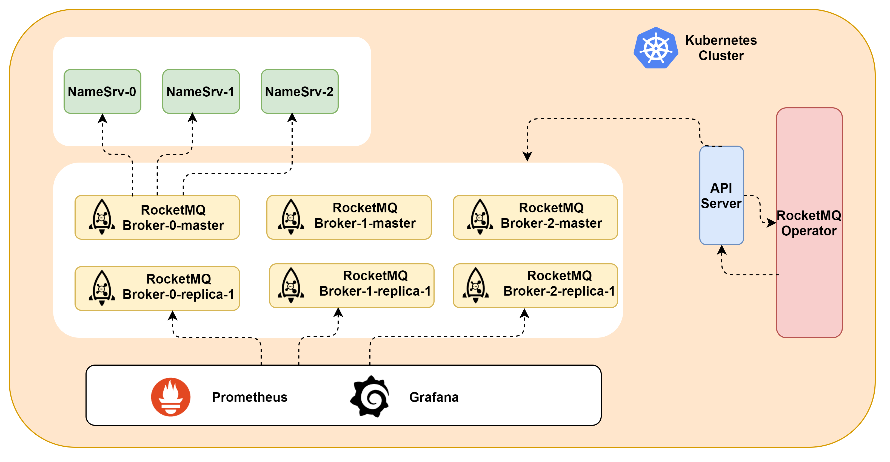

# rocketmq-operator

#### Description
RocketMQ Operator is to manage RocketMQ service instances deployed on the Kubernetes cluster. It is built using the Operator SDK, which is part of the Operator Framework.

#### Software Architecture

#### Installation

1. Install CRD resource
`make install`

2. Deploy ROperator
`make deploy`

#### Instructions

1.  xxxx
2.  xxxx
3.  xxxx

#### Contribution

1.  Fork the repository
2.  Create Feat_xxx branch
3.  Commit your code
4.  Create Pull Request

## License

Copyright (c) 2023. China Mobile(SuZhou)Software Technology Co.,Ltd. All rights reserved.

 seecScanner is licensed under Mulan PSL v2.

You can use this software according to the terms and conditions of the Mulan PSL v2.
You may obtain a copy of Mulan PSL v2 at:

 http://license.coscl.org.cn/MulanPSL2

THIS SOFTWARE IS PROVIDED ON AN "AS IS" BASIS, WITHOUT WARRANTIES OF ANY KIND,
EITHER EXPRESS OR IMPLIED, INCLUDING BUT NOT LIMITED TO NON-INFRINGEMENT,
MERCHANTABILITY OR FIT FOR A PARTICULAR PURPOSE.
See the Mulan PSL v2 for more details.
